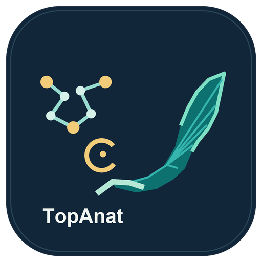

# BgeeDB TopAnat on OSCAR



This synchronous and asynchronous OSCAR service uses [BgeeDB](https://bioconductor.org/packages/BgeeDB) (an R/Bioconductor package) and [topGO](https://bioconductor.org/packages/topGO) to run [TopAnat](https://www.bgee.org/analysis/top-anat/) ([official tutorial](https://www.bgee.org/support/tutorial-TopAnat)): enrichment of anatomical structures in which genes are expressed according to [Bgee](https://www.bgee.org/). It downloads reference annotations and expression calls from Bgee; it does **not** host the Bgee database. Outbound HTTPS access to Bgee is required.

## Container image and limitations

The FDL uses the upstream [Bgee R image](https://hub.docker.com/r/bgeedb/bgee_r) directly, pinned by digest. It includes R 4.5.0 and BgeeDB 2.34.0; no Dockerfile, image build, or private registry is required. Only **`linux/amd64`** is published. An arm64 Kubernetes node needs working amd64 emulation; otherwise a native image is required. The target cluster must be able to pull from Docker Hub.

Deploy from this crate directory with [OSCAR CLI](https://github.com/grycap/oscar-cli) v2.1.0 or newer. Replace `<cluster>` with a configured cluster that has MinIO storage and supports running this image; `localhost-oidc-grycap` was the local test target:

```sh
oscar-cli hub deploy bgee-topanat --cluster <cluster> --local-path ../
```

The [FDL](fdl.yml) requests 1 CPU and 1536 MiB of memory and uses the `minio.default` input/output paths `bgee-topanat/input` and `bgee-topanat/output`. Uploading an object to the input path triggers an asynchronous job. The upstream [BgeeDB package](https://bioconductor.org/packages/BgeeDB) is GPL-3-licensed; the service uses it without redistributing a derived container image.

[The analysis script](script.sh) is supplied by OSCAR and feeds R code into `Rscript -` on the upstream image. OSCAR invokes it via `/bin/sh`; `INPUT_FILE_PATH` is the input TSV, and `TMP_OUTPUT_DIR` receives `topanat-results.tsv`. The cache defaults to `/tmp/bgee-cache` inside each job: it is ephemeral, and no volume is configured. The default Bgee release is **15.2** and the default species is **Danio_rerio**; `BGEE_RELEASE`, `BGEE_SPECIES`, and `BGEE_CACHE_DIR` can override them. Match the input gene IDs to the species and release. A 1 GiB job was OOMKilled in the local test; **1536 MiB and 1 CPU** passed with the pinned upstream image on local Kind. These are tested limits, not measured peak-memory requirements.

## Input and output

[`input.tsv`](input.tsv) has exactly two tab-separated columns: `gene_id` (unique gene identifier) and `selected` (`1` for foreground genes; `0` for background-only genes). Both classes must be present. The background comprises **all rows**, including selected genes. The example is a redistribution as plain TSV of [the upstream BgeeDB `geneList.RData` example](https://github.com/BgeeDB/BgeeDB_R/blob/a4605555db4eab28a30ab5a506b9ab2aaa8155ef/data/geneList.RData): 3,005 zebrafish genes, 147 foreground genes chosen for their pectoral-fin phenotype. The original example and method are explained in the [BgeeDB manual](https://bioconductor.org/packages/release/bioc/vignettes/BgeeDB/inst/doc/BgeeDB_Manual.html). It is example data, not a generally applicable gene universe.

The output TSV has `organId`, `organName`, `annotated`, `significant`, `expected`, `foldEnrichment`, `pValue` and `FDR` columns. The first row in this pinned example is the pectoral fin (`UBERON:0000151`), although exact values can change with upstream data or software revisions.

For a synchronous invocation, the service returns the generated TSV directly. Use `--decode-output` to extract it from the response (which also includes logs); this example writes the TSV locally:

```sh
oscar-cli service run bgee-topanat --cluster <cluster> --file-input input.tsv --decode-output --output topanat-results.tsv
```

The reference-data download and analysis can take several minutes; the synchronous request must remain open until completion. Use the asynchronous input/output path if the client or ingress has a shorter timeout.

## Local execution and acceptance

A direct Docker run uses the same OSCAR environment variables:

```sh
mkdir -p output
docker run --rm --platform linux/amd64 -i \
  -v "$PWD/input.tsv:/input.tsv:ro" -v "$PWD/output:/output" \
  -e INPUT_FILE_PATH=/input.tsv -e TMP_OUTPUT_DIR=/output \
  bgeedb/bgee_r@sha256:64c961e5953ec47194e9cec25e90091deb4091e15e66683e6d2f47063c6f2cca \
  /bin/sh < script.sh
```

The [RO-Crate metadata](ro-crate-metadata.json) defines synchronous and asynchronous acceptance tests. From this crate directory, inspect their planned commands and then run them against the same cluster:

```sh
oscar-cli hub validate bgee-topanat --local-path ../ --print-acceptance-commands
oscar-cli hub validate bgee-topanat --cluster <cluster> --local-path ../
oscar-cli service logs list bgee-topanat --cluster <cluster>
oscar-cli bucket get bgee-topanat --prefix output/ --cluster <cluster>
```

The synchronous acceptance test checks for `pectoral fin` in the decoded response. The asynchronous acceptance test checks for the same term in the latest output and waits a fixed four minutes, so it can fail if image pulling or job admission takes longer; it could also read an older output if the new job fails. Check the job associated with the new upload and the output object's modification time before treating an asynchronous pass as end-to-end evidence. The [OSCAR asynchronous invocation guide](https://docs.oscar.grycap.net/latest/invoking-async/) explains the MinIO input/output flow.
