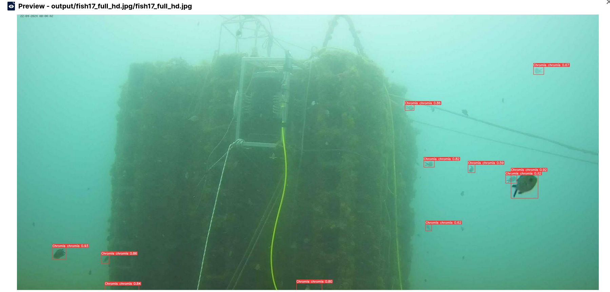
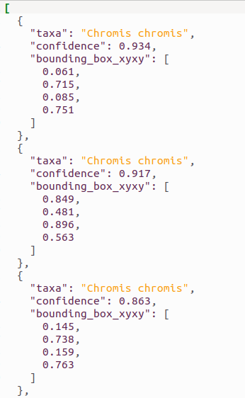

# OBSEA Fish Detection

AI-based fish detection and classification algorithm based on YOLOv8. The model has been finetuned to detect and classify fish at the OBSEA underwater observatory.

This is a container that will run the [obsea-fish-detection](https://dashboard.cloud.imagine-ai.eu/catalog/modules/obsea-fish-detection) application leveraging the DEEP as a Service API component. The application is based on the [ai4oshub/ai4os-yolov8-torch](https://hub.docker.com/r/ai4oshub/ai4os-yolov8-torch) module.

The fish-detector service processes individual images. When an image is uploaded to the service's input bucket, the inference model detects and classifies fishes, returning both a processed image with bounding boxes and a JSON file containing the detection results.

## Build the image

Build the image from the crate root so the Dockerfile can access the `docker/` directory:

```bash
cd docker
docker build -t ghcr.io/<your-org>/fish-detector:latest .
```

Push the image to your registry and update the `image:` reference in `fdl.yml` if needed.

Here is an example of a prediction output:





