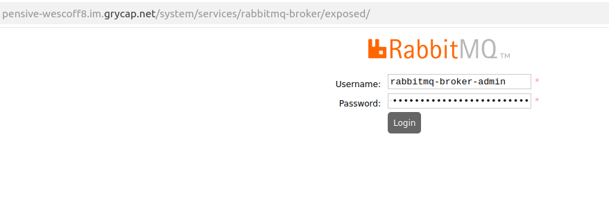
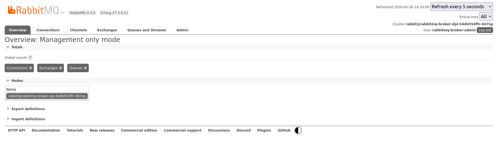

# 🐰 RabbitMQ Broker

This project implements a broker [RabbitMQ](https://www.rabbitmq.com) that can be used for IoT applications. The service also creates an administrator user (**service-name-admin**) with a password (**service-token**) that will be used to configure all broker operations.
---

### 📌 RabbitMQ Admin

The **Administrator** role represents the highest level of privileges in the broker. Unlike other technical roles (such as `monitoring` or `policymaker`), the Admin has absolute control over security, network topology, and the overall behavior of the system, regardless of the environment (*Virtual Host*).

### 🏛️ Key Areas of Responsibility

The functions of an administrator are consolidated into four fundamental pillars, accessible both via the **Command Line (`rabbitmqctl`)** and the **Web Interface (Dashboard)**:

#### 1. Access Control and Security (AuthN/AuthZ)
* **Identity Management:** Creation, modification, and deletion of user accounts.

* **Role Assignment:** Definition of profiles (Admin, Monitoring, Management).

* **Permission Governance:** Restriction or granting of read/write access for applications to different independent environments (Virtual Hosts).

#### 2. Environment Management (Virtual Hosts)
* **Traffic Isolation:** Creation and deletion of *vhosts* to segment projects or stages of the software lifecycle (e.g., `/development`, `/testing`, `/production`) within the same server, either physically or logically.

#### 3. Behavior Orchestration (Policies)
* The administrator defines the **Policies**, which are automatic rules that alter the message lifecycle without requiring modifications to application code. This includes:

* Configuring **High Availability (HA)** and message replication between nodes.

* Defining automatic timeouts (**TTL**) to prevent memory runout.

* Setting maximum size and overflow limits for queues.

#### 4. Operational Support and Crisis Mitigation
* **Hot Intervention:** Ability to force close faulty or overloaded applications.

* **Emergency Cleanup:** Bulk purging of accumulated messages or removal of corrupted queues.

* **Cluster Health:** Monitoring of critical system alarms (crashes due to insufficient RAM or disk space).


## Definition of the service in the fdl file

The FDL that defines the exposed service is the following:

```
functions:
  oscar:
  - rabbitMQ-cluster:
      name: rabbitmq-broker
      image: rabbitmq:4.3.0
      memory: 2Gi
      cpu: '1.0'
      script: script.sh
      expose:
        min_scale: 1
        max_scale: 1
        api_port: [15672,1883,5672]  
        cpu_threshold: 80     
        default_command: false 
        rewrite_target: false
        nodePort: [0, 0, 0]

```

Key elements to highlight include the following:

Image: The latest available version of RabbitMQ (**rabbitmq:4.3.0**) is used.

api_port: Defines the ports to be used in the exposed service for each of the protocols (15672 -- api/dashboard, 1183 -- MQTT, 5672 -- AMQP)

nodePort: In this image, they are generated dynamically by the service to avoid interference with other services.

## Service script configuration

The service script configures the broker and creates an administrator user (**service-name-admin**) and password (**service-token**) with full privileges to interact with the broker via console or dashboard.


## Run client

The administration interface can be accessed via a web browser using the OSCAR exposed service definition (cluster.im.grycap.net/system/services/serviceName/exposed/) and the generated credentials. 



From this interface, you can perform the tasks necessary for your application.



Once you have your application set up, you can use any client that sends AMQP messages, MQTT messages, or HTTP requests.

We have developed 3 Python scripts that will allow you to interact with the broker through different protocols.

Key elements:

- Username: This will be the name you assigned to the service (SERVICE_NAME).

- Password: This will be the token for the created service.

- Publishing topic: This will have the format oscar.SERVICE_NAME for AMQP and HTTP requests, and oscar/SERVICE_NAME for MQTT.

- RabbitMQ broker URL: The domain name of the cluster where you deployed the service. The domain without HTTPS.

- Port: The nodePort defined when creating the service. If the protocols were created dynamically, use the OSCAR API (/system/services/serviceName) to view the port assigned to each protocol.

Important libraries for each script:

- queue-publisher-amqp.py

pika: This is the official Python client library for communicating with RabbitMQ.

boto3: This is the standard library for any S3-compatible system (like your MinIO).

- queue-publisher-mqtt.py

paho.mqtt: The most widely used open-source library for implementing the MQTT protocol.

- queue-publisher-http.py

requests: Python's most popular way to make HTTP requests.

## Notes

All information about using the RabbitMQ broker can be found at:

[Official website](https://www.rabbitmq.com/)

[Github](https://github.com/rabbitmq/rabbitmq-website)


